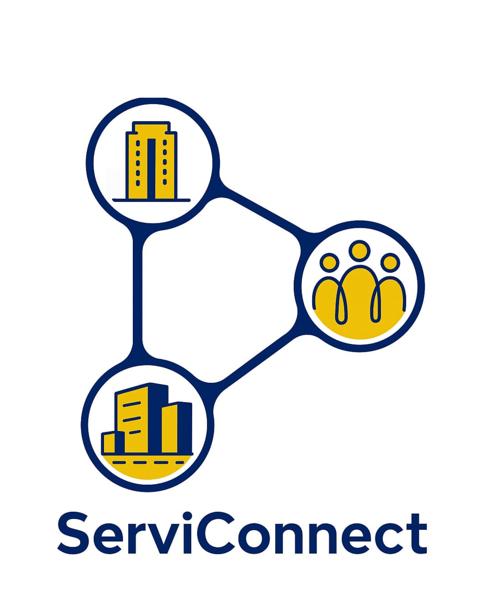
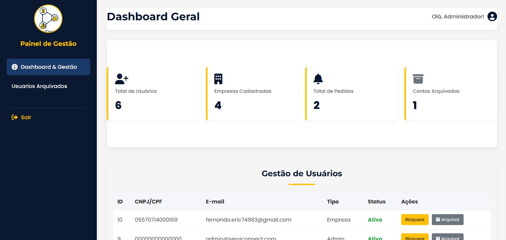
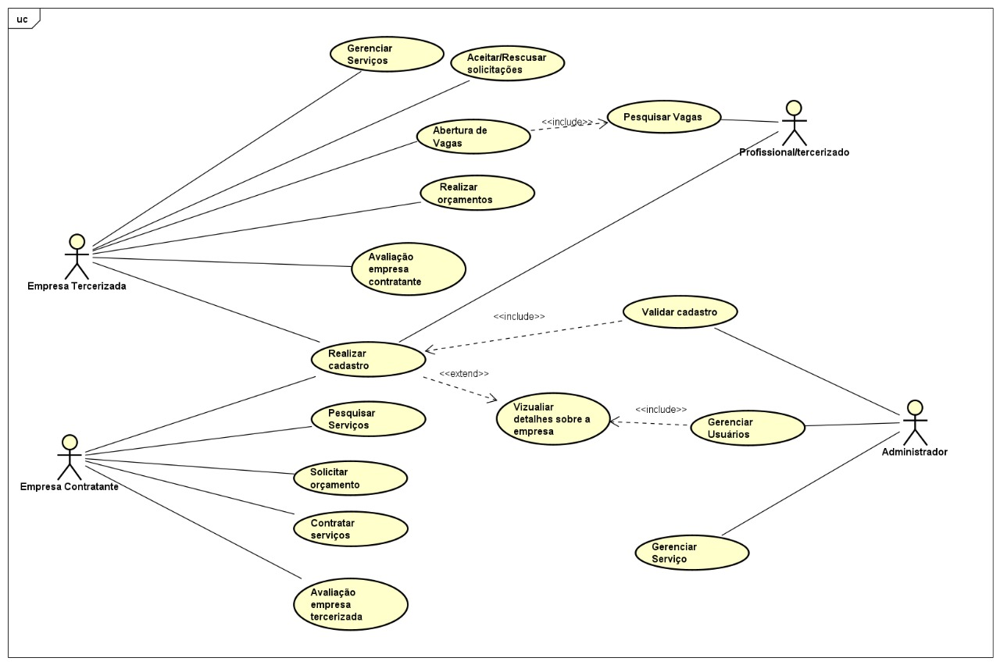

<div align="center">
  
  <h1 style="display: inline; align: center;">
    <font color="darkblue">Servi</font><font color="#FFC107">Connect</font>
  </h1>
</div>

<p align="center">
  <strong>A plataforma ideal para conectar empresas contratantes a prestadoras de serviços terceirizados de forma prática, segura e transparente.</strong>
</p>

<p align="center">
  
  
  
  
  
</p>

---

## 📖 Sobre o Projeto

O **ServiConnect** é um sistema web desenvolvido para otimizar e centralizar o processo de contratação de serviços B2B (Business-to-Business). Seja para serviços de limpeza, segurança, manutenção ou TI, a plataforma oferece um ambiente dedicado onde as necessidades encontram as soluções certas.

---

## 🖼️ Visão Geral e Arquitetura

Abaixo apresentamos uma visão do painel do sistema e o diagrama que ilustra as interações dos utilizadores com a plataforma.

### Painel de Gestão

> *Visão do painel administrativo do sistema, permitindo o acompanhamento de métricas e a gestão da plataforma.*

### Diagrama de Casos de Uso

> *Representação estrutural demonstrando as ações e permissões de cada tipo de utilizador (Contratante, Terceirizada e Administrador) dentro do sistema.*

---

## 👥 Equipe

**Desenvolvedores:**
* **Fernando Eric Freitas da Silva** - [🔗 LinkedIn](https://www.linkedin.com/in/fernando-eric-403636248/)
* **Leonardo Quintino Santos**

**Orientadores:**
* Prof. Jeferson Roberto de Lima
  
---

## ✨ Principais Funcionalidades

O sistema conta com três frentes principais de utilizadores, garantindo fluxos de trabalho específicos:

### 🏢 Para Empresas Contratantes
* **Busca e Filtros:** Encontre facilmente empresas terceirizadas por região e área de atuação.
* **Solicitação de Orçamentos:** Envie pedidos detalhados (número de funcionários, local, descrição) diretamente para os prestadores.
* **Gestão de Contratações:** Acompanhe as empresas disponíveis e as propostas recebidas.

### 💼 Para Empresas Terceirizadas (Prestadoras)
* **Perfil Público:** Destaque os seus serviços, adicione uma foto/logótipo, descreva a sua área de atuação e regiões atendidas.
* **Gestão de Pedidos:** Receba notificações de pedidos de orçamento de contratantes interessados.
* **Resposta Rápida:** Envie a sua proposta de valor diretamente pela plataforma ou recuse o pedido se não tiver disponibilidade.

### 🛡️ Para a Administração (Gestão)
* **Painel de Controlo:** Dashboard com métricas totais de utilizadores, empresas e pedidos realizados no sistema.
* **Gestão de Utilizadores:** Pesquisa avançada e capacidade de bloquear e desbloquear contas por mau uso da plataforma.
* **Conformidade LGPD:** Funcionalidade de "Arquivar" contas (soft delete), guardando os dados de forma segura e inativando o acesso sem perda de histórico.

---

## 🛠️ Tecnologias Utilizadas

**Frontend:**
* 🌐 **HTML5 & CSS3** (Design Responsivo, Flexbox/Grid)
* 🟨 **JavaScript Vanilla**
* 🔌 **Integração com APIs externas** (ViaCEP e OpenCNPJ)
* 🗺️ **Leaflet.js** (Mapas interativos)

**Backend:**
* 🐘 **PHP 8.x** (Arquitetura MVC simplificada)
* 🗃️ **PDO** (Consultas seguras à base de dados)

**Base de Dados:**
* 🐬 **MySQL** (Tabelas relacionais)

**DevOps & CI/CD:**
* ⚙️ **GitHub Actions** para Deploy Automático (FTP) e Verificação de Sintaxe PHP (Lint).

---

## 🚀 Como Executar o Projeto Localmente

Siga os passos abaixo para rodar o projeto na sua máquina utilizando o XAMPP ou servidor equivalente:

1. **Clone o repositório:**
   ```bash
   git clone [https://github.com/fernandoeric-dev/serviconnect.git](https://github.com/fernandoeric-dev/serviconnect.git)
